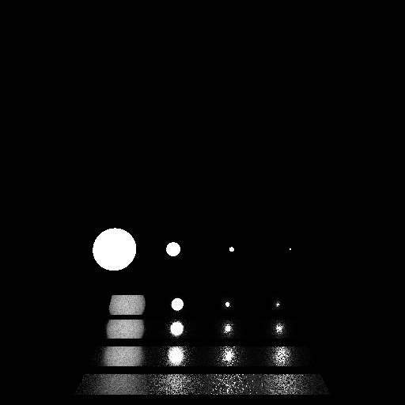

# 大作业-MIS

1. 在作业 7 的基础上实现了 microfacet 的 GGX 材质
2. 实现了 microfacet 材质的重要性采样（以 half vector 分布作为重要性采样标准）
3. 结合光源采样实现了 balanced 的 MIS 采样
4. 示例图片，视频和 ppt 在 images 文件夹中

5. microfacet GGX
6. using the multiple importance sampling
7. implement balanced MIS
8. sample images in the image folder

